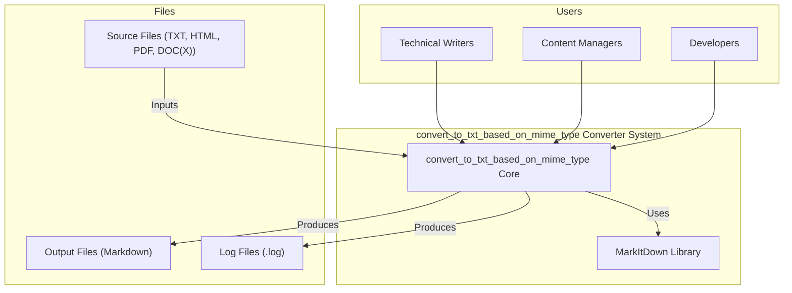
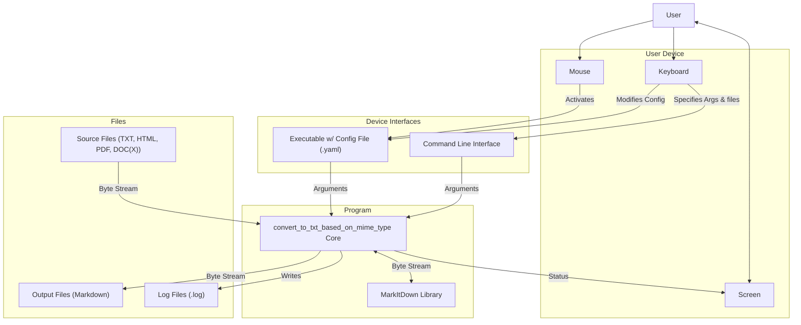
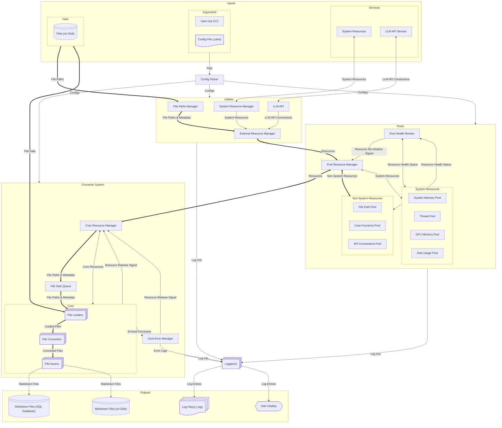

# Software Architecture Document (SAD)
- SAD design from: https://arc42.org/overview#solution-strategy

## Table of Contents
1. [Introduction: MVP](#introduction-mvp)
2. [Constraints](#constraints)
3. [System Context](#system-context)
4. [Solution Strategy](#solution-strategy)
5. [Building Block View](#building-block-view)
6. [Runtime View](#runtime-view)
7. [Deployment View](#deployment-view)
8. [Cross-cutting Concepts](#cross-cutting-concepts)
9. [Architecture Decisions](#architecture-decisions)
10. [Quality Requirements](#quality-requirements)
11. [Risks and Technical Debt](#risks-and-technical-debt)
12. [Glossary](#glossary)

## Introduction: MVP
| Category                      | Description                                                                                                                                                                                                                                 |
| ----------------------------- | ------------------------------------------------------------------------------------------------------------------------------------------------------------------------------------------------------------------------------------------- |
| **Product Name**              | FileToMark Converter                                                                                                                                                                                                                        |
| **Core Purpose**              | Convert various file types into well-formatted markdown while maintaining maximum stability                                                                                                                                                 |
| **Primary Features**          | • File type detection and validation<br>• Basic conversion of TXT, HTML, PDF, DOC(X)<br>• Stream-based processing for memory efficiency<br>• Error logging and recovery<br>• Progress monitoring                                            |
| **Technical Architecture**    | • Functional core for conversion logic<br>• Reactive streams for file handling<br>• Pure functions for individual format processors<br>• Immutable data structures for content manipulation<br>• Error monad for predictable error handling |
| **MVP Limitations**           | • Limited to files under 100MB<br>• Basic styling conversion only<br>• No batch processing<br>• No custom markdown templates<br>• Single concurrent conversion only                                                                         |
| **Success Metrics**           | • 95% successful conversions<br>• No memory leaks<br>• Under 1% crash rate<br>• Correct markdown syntax in output                                                                                                                           |
| **Target Users**              | • Technical writers<br>• Documentation specialists<br>• Content managers<br>• Developers needing documentation tools                                                                                                                        |
| **Initial Supported Formats** | • Anything currently supported by the [MarkItDown](https://github.com/microsoft/markitdown) library                                                                                                                                         |
| **Error Handling**            | • Graceful failure recovery<br>• Detailed error logging<br>• Partial conversion recovery<br>• Input validation feedback<br>• Resource cleanup on failure                                                                                    |
| **Resource Management**       | • Streaming for large files<br>• Automatic garbage collection<br>• Resource usage monitoring<br>• Memory bounds checking<br>• File handle management                                                                                        |

## Constraints

convert_to_txt_based_on_mime_type shall be:
- 100% stable and reliable. No program-breaking crashes or memory leaks.
- Support all formats currently supported by the MarkItDown library.
- Handle files up to 100MB in size.
- Robust error handling
- Potential to expand to batch processing and concurrent operations.
- Easily expandable to allow for additional file formats.
- Open-source libraries only. No proprietary software other than via API.


## Solution Strategy
| Quality Goal | Scenario | Solution  Approach | Link to Details |
|--------------|----------|--------------------|-----------------|
| 95% successful conversions | 
| No memory leaks |  |  |  |
| Under 1% crash rate |  |  |  |
| Correct markdown syntax in output |  |  |  |
| Error logging and recovery |  |  |  |


## System Context

### 1. Business Context


| Node | Description |
|----------|-------------|
| TW       | Technical Writers who need to convert files to markdown for documentation purposes. |
| CM       | Content Managers who need to convert files to markdown for content management purposes. |
| DV       | Developers who need to convert files to markdown for document processing purposes. |
| FC       | FileToMark Core, the main component of the system that handles the conversion process. |
| ML       | MarkItDown Library, a library used by the FileToMark Core to perform the actual conversion. |

```mermaid
flowchart TB
```

### 2. Technical Context


## Building Block View

User Arguments:
| Argument | Description | Default |
|----------|-------------|-------------|
| input_folder | Path to the folder containing the files to be converted. | /inputs |
| output_folder | Path to the folder where the converted files will be saved. | /outputs |
| max_memory | Maximum amount of memory in Megabyes the program can use at any one time. | 1024 |
| conversion_timeout | Maximum amount of time in seconds an API-bounded conversion can run before it is terminated. | 30 |
| log_level | Level of logging to be used. | INFO |
| max_connections_per_api | Maximum number of concurrent API connections the program can have at any one time. | 3 |
| max_threads | Maximum number of threads to be used for processing the program can use at any one time. | 4 |
| batch_size | Number of files to be processed in a single batch. | 1024 |
| api_key | API key for the LLM API. | 123456 |
| api_url | URL for the LLM API. | www.example.com |
| use_docintel | Use Document Intelligence to extract text instead of offline conversion. Requires a valid Document Intelligence Endpoint | False |
| docintel_endpoint | Document Intelligence Endpoint. Required if using Document Intelligence | www.example2.com |
| version | (CLI only) Version of the program. | 0.1.0 |
| help | (CLI only) Show help message and exit. | False |
| pool_refresh_rate | Refresh rate in seconds for refreshing resources in the Pools. | 60 |
| pool_health_check_rate | Health check rate in seconds for checking resources in the Pools. | 30 |



```mermaid
flowchart TB


```

Rationale:
- 


| Building Blocks | Description | Techniques |
|-----------------|-------------|------------|
| FileLoader      |             | Lazy Loading |
| ApiManager   | Construct API connections to LLM services. |  |


## Runtime View

## Deployment View

## Cross-cutting Concepts

## Architecture Decisions

## Quality Requirements

## Risks and Technical Debt

## Glossary


```python
from pathlib import Path

def main(
    inputs: list[str], 
    output_folder: str | Path,
    ) -> None: 
    """
    Convert a list of files or URLs to text files based on their MIME type. It is designed to handle common file formats such as PDF, DOCX, and HTML, with modularity in mind to allow for easy expansion to future formats.


    Key Features:
    - Dynamic MIME type detection and processing
    - Automated format conversion to plain text
    - Flexible URL input handling
    - Modular design for easy expansion to new formats
    - High stability
    - Robust error management for failed conversions

    Args:
        inputs (list[str]): A list of file paths or URLs to be converted.

    Returns:
        A folder with txt version of the input files.

    """
    # Determine which files can be converted, based on whether or not we support it yet.

    # For all the files that can be converted, do the following:
        # Get it's MIME type.
        # Route it to the correct converter based on the MIME type.
        # Convert it to a text file.
        # Save the text file to the output folder.
```


Program Inputs:
- List of files or URLs to be converted.
- type


Program Outputs: 
- A folder of the converted files.


1. Determine if it can be converted
2. 


1. Determine which files can be converted.
    If mode is "files" then: 
        1.1a: Get the folder path to the files.
        1.2a Get a list of file paths from a folder.
        For each file path, do the following:
            1.3a: Check if the file is supported. 
            If not valid, 
                1.4a: log it then skip.
            If valid:
                1.5b: Add it to the list of files to be converted.

    If mode is "urls" then: 
        1.1b: Get a list of URLs from a file.
            - Supported file types: JSON, CSV, TXT.
        For each URL, do the following:
            1.2b: Check if the URL is valid.
                - Valid URL: A URL that starts with "http://" or "https://" and has a valid domain name.
            If not valid, 
                1.3b: log it then skip.
            If valid:
                1.4b: Query the URL.
                If we got a response:
                   1.5b: 

2. For each file, do the following:
    2.1 Check its mime type. 
        - If it's not a supported type, 
            2.2a log it and skip to the next file.
        - If it's a supported type, 